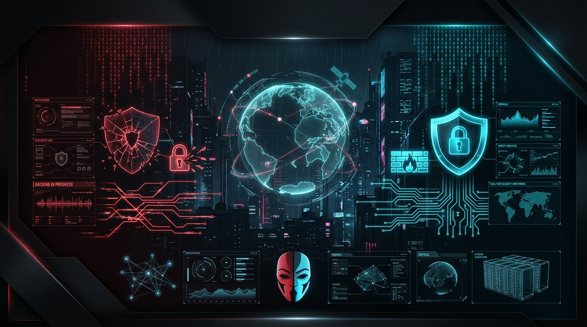
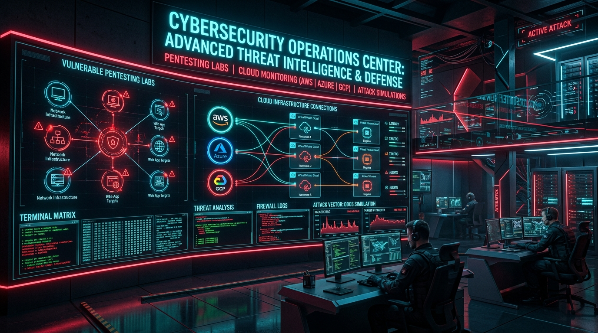

<div align="center">

<!-- HERO BANNER -->


<br/>

<!-- DYNAMIC TYPING HEADLINE -->
<a href="https://github.com/Cyberdark-Security">
  
</a>

<p align="center">
  <a href="https://www.whoami-labs.com"></a>
  <a href="https://www.linkedin.com/in/maocamacho/"></a>
  <a href="https://github.com/Cyberdark-Security"></a>
  <a href="mailto:contact@whoami-labs.com"></a>
  
</p>

</div>

---

### 📡 `TERMINAL // IDENT_RECORD`

```yaml
identity:
  handle: "Cyberdark"
  role: "Lead Cybersecurity Architect & Offensive/Defensive Operator"
  specialization:
    - "Advanced Penetration Testing (Web / API / Active Directory / Cloud)"
    - "Threat Hunting, Detection Engineering & SIEM/EDR Hardening"
    - "Automated DevSecOps Pipelines & Multi-Cloud Infrastructure (AWS/Azure/GCP/OCI)"
  ecosystem: "Founder of Whoami-Labs — High-fidelity Vulnerable Cyber Arenas"
  philosophy: "Security through Offensive Emulation & Uncompromising Hardening"
```

---

## 🏆 Verified Credentials & Certifications

<div align="center">

### ⚔️ Offensive Security
<p align="center">
  
  
  
  
  
  
</p>

### 🛡️ Defensive, SOC & Vulnerability Management
<p align="center">
  
  
  
  
  
  
</p>

### ☁️ Cloud & Governance
<p align="center">
  
  
  
  
  
  
</p>

</div>

---

## 🛠️ Tactical Arsenal & Core Stack

<table>
  <tr>
    <td width="50%" valign="top">
      <h3 align="center">⚔️ Red Team & Offensive Tooling</h3>
      <ul>
        <li><b>Network & Recon:</b> <code>Nmap</code>, <code>Masscan</code>, <code>Shodan</code>, <code>Censys</code>, <code>Amass</code></li>
        <li><b>Web / API Exploitation:</b> <code>Burp Suite Pro</code>, <code>OWASP ZAP</code>, <code>SQLmap</code>, <code>ffuf</code>, <code>Postman</code></li>
        <li><b>Active Directory:</b> <code>BloodHound</code>, <code>Impacket</code>, <code>Mimikatz</code>, <code>CrackMapExec</code>, <code>Rubeus</code></li>
        <li><b>Privilege Escalation:</b> <code>LinPEAS</code>, <code>WinPEAS</code>, <code>Pspy</code>, <code>PowerUp</code></li>
        <li><b>Exploit & Cracking:</b> <code>Metasploit</code>, <code>Hashcat</code>, <code>John The Ripper</code>, <code>Hydra</code></li>
      </ul>
    </td>
    <td width="50%" valign="top">
      <h3 align="center">🛡️ Blue Team & Defensive Stack</h3>
      <ul>
        <li><b>Vulnerability Mgmt:</b> <code>Qualys VMDR</code>, <code>Tenable Nessus</code>, <code>OpenVAS</code></li>
        <li><b>SIEM & Telemetry:</b> <code>Splunk</code>, <code>Elastic Stack (ELK)</code>, <code>Zeek</code>, <code>Wazuh</code></li>
        <li><b>Perimeter & Endpoint:</b> <code>Fortinet FortiGate</code>, <code>Palo Alto Networks</code>, <code>Netskope</code></li>
        <li><b>Compliance & Benchmarks:</b> <code>MITRE ATT&CK</code>, <code>CIS Benchmarks</code>, <code>ISO 27001</code>, <code>NIST CSF</code></li>
        <li><b>Forensics & Analysis:</b> <code>Volatility</code>, <code>Wireshark</code>, <code>Autopsy</code>, <code>Ghidra</code></li>
      </ul>
    </td>
  </tr>
  <tr>
    <td width="50%" valign="top">
      <h3 align="center">☁️ Multi-Cloud & DevSecOps</h3>
      <ul>
        <li><b>Cloud Environments:</b> <code>AWS</code>, <code>Microsoft Azure</code>, <code>Google Cloud (GCP)</code>, <code>Oracle Cloud (OCI)</code></li>
        <li><b>Container Security:</b> <code>Docker</code>, <code>Kubernetes (K8s)</code>, <code>Trivy</code>, <code>Falco</code></li>
        <li><b>IaC & Automation:</b> <code>Terraform</code>, <code>Ansible</code>, <code>GitHub Actions CI/CD</code></li>
      </ul>
    </td>
    <td width="50%" valign="top">
      <h3 align="center">💻 Languages & Development</h3>
      <p align="center">
        
      </p>
    </td>
  </tr>
</table>

---

## 🌐 Ecosistema Whoami-Labs & Threat Research

<div align="center">

</div>

<br/>

> **[Whoami-Labs](https://www.whoami-labs.com)** es un ecosistema de entrenamiento y simulación ofensiva/defensiva diseñado para replicar entornos de producción reales, vectores de compromiso modernos, exploits zero-day y hardening multi-cloud.

- 🎯 **Laboratorios Vulnerables:** Escenarios de pentesting orientados a Active Directory, entornos cloud y Web APIs.
- ⚡ **Automatización Inteligente:** Pipelines de despliegue $0 cost con observabilidad integral y simulación de amenazas.
- 🎥 **Educación Técnica:** Transmisión de conocimientos prácticos a través de YouTube (Cyberdark / IASHORTS) y contenidos interactivos.

---

## 📬 Encrypted Comms & Social Uplinks

<div align="center">

[](https://www.whoami-labs.com)
[](https://www.linkedin.com/in/maocamacho/)
[](https://github.com/Cyberdark-Security)
[](https://youtube.com)

<br/>

<sub>*"In the digital domain, perimeter defense is an illusion. Assume breach, hunt proactively, automate relentlessly."*</sub>

</div>
