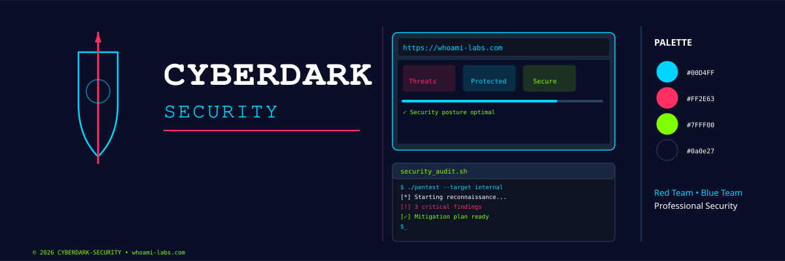

> **Red Team • Blue Team • Automation**
>
> Especialista en Ciberseguridad Ofensiva & Defensiva

---

## 👤 About Me

**Ingeniero de Sistemas** especializado en seguridad ofensiva y defensiva con experiencia probada en:

- **⚔️ Red Team:** Pentesting activo, escalada de privilegios, explotación (Web/Mobile/API/AD)
- **🛡️ Blue Team:** Endurecimiento, gestión de vulnerabilidades, análisis forense, compliance
- **⚙️ Automation:** DevSecOps, CI/CD security, scripting en Python/Bash/PowerShell
- **📋 Governance:** ISO 27001, MITRE ATT&CK, OWASP Top 10, NIST Framework

---

## 🏆 Certified

**Offensive Security:** eJPT • CAP • COSJ • CPPJ • EHCA • CCE

**Defensive & Analysis:** CCST • IBM Cybersecurity • Google Security • ISC² CC • FortiGate FCA • Qualys VMDR/EDR

**Cloud:** ICCA • AZ-900 • SC-900 • MS-900 • OCI Foundations • GitHub Foundations

**Leadership:** LCSPC • ISO 27001 • MCE

---

## 🛠️ Technical Skills

**Languages:** Python • Bash • PowerShell • Go • TypeScript • JavaScript • C# • C++

**Infrastructure:** Linux • Windows • macOS • Docker • Kubernetes • AWS • Azure • GCP

**Offensive Tools:** Kali Linux • Burp Suite • Metasploit • Nmap • Wireshark • SQLmap • Hashcat • BeEF

**Defensive Tools:** Fortinet • Palo Alto • Netskope • Intune • Qualys • Nessus • Splunk • ELK • Zeek

**Frameworks:** MITRE ATT&CK • OWASP • NIST • CIS Benchmarks • Nuclei • Shodan • Censys

---

## 🎯 Core Expertise

| Pentesting Web | Active Directory | Mobile Security | Cloud Security |
|:---|:---|:---|:---|
| OWASP Top 10 | Kerberoasting | iOS/Android | IAM Hardening |
| SQLi/XSS/CSRF | Golden Ticket | API Testing | S3 Exposure |
| Bypass Auth | Lateral Movement | Reversing | Secrets Mgmt |
| API Hacking | Pass-the-Hash | Data Audits | Compliance |

| System Hardening | Threat Intelligence | Incident Response | Compliance |
|:---|:---|:---|:---|
| CIS Benchmarks | SIEM Configuration | Log Analysis | ISO 27001 |
| Configuration Audit | EDR Analysis | Threat Hunting | SOC2 |
| Vulnerability Mgmt | MITRE Mapping | Forensics | GDPR/HIPAA |
| Access Control | Threat Modeling | Timeline Creation | Policy Design |

---

## 🔗 Connect

- **Website:** [whoami-labs.com](https://www.whoami-labs.com)
- **LinkedIn:** [/in/maocamacho](https://www.linkedin.com/in/maocamacho/)
- **GitHub:** [@Cyberdark-Security](https://github.com/Cyberdark-Security)

---

*Built with security-first mentality • Always testing • Always learning*
